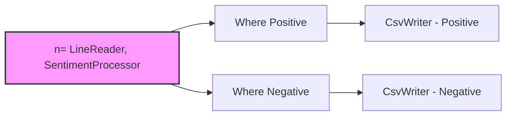
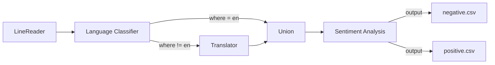
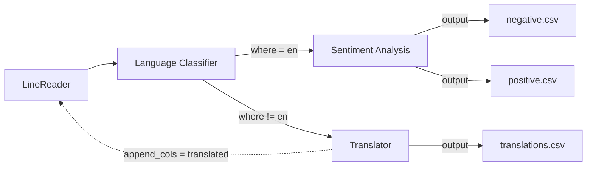
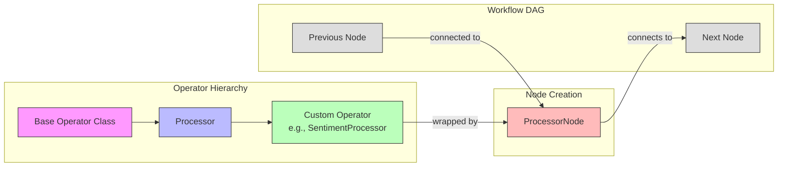

# Popper

## Introduction
In this lab we will look at a dataflow system called Popper for building ML
workflows.  One of the many interesting features of Popper that you will learn
about is its built-in support for in-flight error handling. Popper implements a 
python based dataflow language called PYSCOPE for specifying dataflow programs. 
Users can use traditional data processing operators such as map, filter, join, 
etc. in addition to Popper's in-flight error handling operators ([discussed
later](#part-1-understanding-pyscope)).

## Part 0: Getting Started
### Prerequisites
- Get Docker Desktop installed on your system
  - [Install Docker for Windows](https://docs.docker.com/desktop/install/windows-install/)
  - [Install Docker for macOS](https://docs.docker.com/desktop/install/mac-install/)
  - [Install Docker for Linux](https://docs.docker.com/desktop/install/linux-install/)

<details>
<summary><strong>Important</strong>: For Windows Users</summary>

- You might want to start a docker container for Redis to keep it running in the background.
```python
  $ docker run -d -p 6379:6379 --name redis --rm redis:7.4
  ```
</details>

### Installing Popper

1. Pull the Popper Docker image:
```python
$ docker pull 0xadnan/popper:latest
```

2. Launch Popper in Docker:
```python
$ docker run -p 5173:5173, 16686:16686 -it 0xadnan/popper:latest
```
You should now see a prompt that looks something like:
```python
root@75a91d135cdf:/popper#
```

3. Start Redis:
```python
root@75a91d135cdf:/popper# make redis
```

4. Start the Object Store:
```python
root@75a91d135cdf:/popper# make objstore
```

5. Test if the installation was successful, try running some tests in a new terminal:
```python
# Get container ID
$ docker ps
```
```python
# Connect to container
$ docker exec -it <container_id> /bin/bash
``` 
Our docker image comes with pre-installed Python dependencies required for
Popper.

TODO: 
0. Build docker container for the use case on top of the Popper's docker container.

Here are two scripts to [download light models](./test_light_models.py) and another script to [download heavy models](./test_heavy_models.py) that we will use in this lab.

## Part 1: Understanding PYSCOPE

Before we start writing workflows, let's have a look at PYSCOPE, the dataflow
language POPPER uses to write workflows. PYSCOPE extends the SCOPE language from
Microsoft [VLDB 2008] with inflight error-handling.

* `Extractor`: Constructs rows from unstructured sources like files.
* `Processor`: Processes each row individually.
* `Reducer`: Processes groups of rows.
* `Combiner`: Combines multiple rows (like a traditional join).
* `Outputter`: Writes rows to a data sink.

<!-- PYSCOPE also provides two operators for error handling: [**rowErrorHandler**](#rowerrorhandler), [**rowSetErrorHander**](#rowseterrorhandler) -->

These are base operators provided by PYSCOPE; you can extend these operators to
build you own custom operators. for e.g. `LineReader` can be an `Extractor` that
reads lines from a file.

Now, since we are equipped with the necessary knowledge, let's write our first
workflow!


## Part 2: Writing your first ML workflow

We will walkthrough a simple workflow to get a flavor of how they are written in
Popper. The point of this workflow is to create a simple sentiment analysis
pipeline.

We write 3 main custom operators for this job:
1. `LineReader`: This extends the `Extractor` class and reads lines from a file.
(you can find this operator implemented in `scope/builtins/extractors.py`)
2. `SentimentProcessor`: This extends the `Processor` class and performs
sentiment analysis on the input text. (we will implement this operator in the
next few steps)
3. `CsvWriter`: This extends the `Outputter` class and writes the output to a
CSV file. (you can find this operator implemented in
`scope/builtins/outputters.py`)

First let's get all our necessary imports out of the way:

```python
import os
from typing import Any, Generator

import config
from scope.builtins.outputters import CsvWriter
from scope.core.job import Job
from scope.core.jobbuilder import JobBuilder
from scope.core.nodes import OutputterNode
from scope.core.utils import topologicalSort
from scope.examples.word_count import LineReader
from scope.model.row import Row
from scope.model.rows import Rows
from scope.operators.outputter import Outputter
from scope.operators.processor import Processor
from transformers import pipeline
```

In order to write the workflow, we will use the `JobBuilder` class from
`jobbuilder.py`. This will be our entry point to writing a workflow. The
`JobBuilder` provides a set of methods to add operators to the workflow like
`extract()`, `process()`, `output()`, etc. These operators are then chained
together to form a workflow. [Read more](#node-creation) on how nodes are
created and added to the workflow.

Let's first create a `prepareJob()` function that will return a `Job` object.
Here we will give it the input and output paths and then chain the operators
together to form the workflow.

```python
def prepareJob() -> Job:
    # define input/output paths
    abs_out_path = os.path.join(config.popper.WORKSPACE, "sentiment/ml_out.txt")
    abs_in_path = os.path.join(config.popper.WORKSPACE, "sentiment/ml_in.txt")
```
Within the `prepareJob()` function, we will create a `JobBuilder` object and
then chain the operators together to form the workflow.
```python
    jobc = JobBuilder()
    return jobc.extract(using=LineReader(frm=abs_in_path, out_col=b"line")) \
            .process(using=SentimentProcessor(in_col=b"line", sentiment_col=b"sentiment")) \
            .output(using=CsvWriter(to=abs_out_path, order=[b"line", b"sentiment"])) \
            .job.pre_build()
```

<details>
<summary>Optional: read more about JobBuilder</summary>

JobBuilder also has these (constructor) parameters:
- `disable_opts`: This is an optional parameter that allows you to selectivley disable the [optimizations](#optimizations-in-popper) for the job.
- `dag_opt`: This is a boolean parameter that enables **all DAG optimizations** for the job.
- `enable_gc`: This is a boolean parameter that enables **garbage collection** for the job.
- `hint`: This is an optional parameter that allows you to specify a [hint](#hints) for the job.
- `template`: This is an optional parameter that allows you to specify a name for the job.

Once the job is created, we can call `pre_build()` which will add the necessary
edges to the workflow and saves the initial job state to Redis.
</details>
<br>

Now, let's create our test function `test_run_ml()` to see if our workflow is
working as expected, In this test we will first call `prepareJob()` and then
call `build()` which will type check the entire workflow, optimize the workflow,
and prepare the job for execution.

Finally, we can call `run()` which will execute the workflow, wait for all
stages to complete and return our desired output.

```python
def test_run_ml() -> None:
    job = prepareJob()
    job.build().run()

```

We have not implemented the `SentimentProcessor` operator yet, lets do that now.

Some necessary methods to implement for your custom operator:

You will need to inherit from the `Processor` class and implement the
`__call__()` method.

- The `Processor` base class provides two methods `pre_call()` and `post_call()`
which can be used to perform any setup/cleanup operations.
- The `pre_call()` method is called before the `__call__()` method is called.
You can use this method to load any models you might need.
- The `post_call()` method is called after the `__call__()` method is called.
You can use this method to clean up any resources you might have initialized in
the `pre_call()` method.
- The `__call__()` method is where the main logic of your custom operator goes.

Let's implement `SentimentProcessor` to get a better understanding of how this
works.

```python
class SentimentProcessor(Processor):
    # Initialize the operator with the input and output column names
  def __init__(self, in_col: bytes, sentiment_col: bytes):
    # the `Processor` class takes in two arguments: `in_col_types` and
    # `out_col_types`. These are dictionaries that map the input and output
    # column names to their respective types.
    super().__init__(
        out_col_types={b"model": b"str", sentiment_col: b"str", b"confidence": b"float"},
        in_col_types={in_col: b"str"}
    )

    # Remember the input and output column names
    self.in_col = in_col
    self.sentiment_col = sentiment_col

    # set the sentiment pipeline to None initially
    self.SENTIMENT_PIPELINE = None

  def pre_call(self):
    # Initialize the sentiment analysis pipeline, this is done here, so that
    # we don't have to load the model again and again for each row in the __call__() method
    self.SENTIMENT_PIPELINE = pipeline(
        "sentiment-analysis",
        model="distilbert-base-uncased-finetuned-sst-2-english",
        device=-1
    )

  def post_call(self, **kwargs: Any) -> list[Row]:
    # Clean up the sentiment pipeline
    self.SENTIMENT_PIPELINE = None

  def __call__(self, input_row: Row, *args: Any, **kwargs: Any) -> Generator[Row, None, None]:
    # The __call__() method is where the main logic of your custom operator goes.
    # It takes in an input row and yields an output row.

    # Get the input text
    line = input_row.get_value(self.in_col)
    
    # Perform sentiment analysis
    result = self.SENTIMENT_PIPELINE(line)[0]
    sentiment_label = result['label']
    confidence = result['score']

    # Create output row
    out_row = Row(Rows(**kwargs), from_rows=[input_row], data_dict = {
        self.sentiment_col: sentiment_label,
    })

    # Instead of using data_dict, we can also use the `set()` method to set the
    # value of a column in the output row.
    out_row.set()
    out_row.set(b"confidence", confidence)
    
    yield out_row
```

Now, we can run our test to see if the workflow is working as expected:

```python
# Run test
root@75a91d135cdf:/popper# pytest -s scope/integration_tests/ml_test.py
```

TODO: Move to pytest -s usecases/sentiment/test.py

Once the job is completed, the output will be saved at `data/sentiment/ml_out.txt`.
We observe that all the positive and negative sentiments are correctly
classified and written to the output file.

### Visualizing the workflow
Popper also provides a dashboard to visualize the workflow.  To start the
visualization backend, run the following command:
```python
root@75a91d135cdf:/popper# make server
```

TODO: make sure you have `npm` installed 

To spin up the UI run the following command:
```python
root@75a91d135cdf:/popper# make demo
```
You should now be able to see the dashboard by navigating to [localhost:5173](http://localhost:5173) in your web browser.

TODO: screenshot

Popper also supports performance tracing. To trace jobs, start Jaeger by running:

```python
root@75a91d135cdf:/popper# make jaeger
```

Then rerun the job using the `pytest` command above. Once the job finishes, you
should be able to see the trace by navigating to
[localhost:16686](http://localhost:16686).

TODO: screenshot

This hopefully gave you a good idea on how to write workflows in Popper, 

---
## Exercise 1
> Task: Modify the sentiment analysis job to separate the positive and negative sentiments into different files.

Starting with the existing sentiment analysis job, implement the following
requirements:
- [ ] Try using the `where()` operator in `JobBuilder` to separate the positive
and negative sentiments.
- [ ] The output should show now only show the `line` column.
- [ ] Your output files should now only have the 

<details>
<summary>Need help getting started?</summary>

- Learn how to write `where()` operators from `scope/integration_tests/where_as_group_test.py`.
- You will need two separate outputters to write to two different files for the positive and negative sentiments.
- Try using the `get_node()` method to break the chain and give access to the last node in the workflow (see next section for more details).
</details>
<br>

---
Popper provides you with a `get_node()` accessor method in `JobBuilder` which
returns the last node in the workflow. If you observe, each node in our previous
workflow was connected in a chain like this:

```python
jobc.extract(using=LineReader(frm=abs_in_path, out_col=b"line")) \
    .process(using=SentimentProcessor(in_col=b"line", sentiment_col=b"sentiment")) \
    .output(using=CsvWriter(to=abs_out_path, order=[b"line", b"sentiment"]))
```
using the `get_node()` method, we can **break** the chain and get access to the
last node in the workflow. for eg. we want to break the chain after the
`process()` method and give access of this set of nodes to some other operator.
We can do this as follows:

```python
n = jobc.extract(using=LineReader(frm=abs_in_path, out_col=b"line")) \
        .process(using=SentimentProcessor(in_col=b"line", sentiment_col=b"sentiment")) \
        .get_node()
```
we can now give this node `n` to some other operator using the `inp=` parameter
provided by the node creation methods like `where()`, `output()`, etc.

```python
jobc.where(inp=n, predicate=is_positive, in_col_types={b"sentiment": b"str"}) \
    .output(using=CsvWriter(to=abs_out_path, order=[b"line"], gt=(gt_pos_path, csv_parse)))

jobc.where(inp=n, predicate=is_negative, in_col_types={b"sentiment": b"str"}) \
    .output(using=CsvWriter(to=abs_out_path, order=[b"line"], gt=(gt_neg_path, csv_parse)))
```



## Part 3: Multi-lingual sentiment analysis 

## Exercise 2
> Task: Create a multi-lingual sentiment analysis workflow that can handle both English and non-English text.

Starting with the sentiment analysis job from Exercise 1, implement a workflow that:

Use the following ML models:
  * Language classifier: `papluca/xlm-roberta-base-language-detection`
  * Translator: `facebook/nllb-200-distilled-600M`
  * Sentiment analyzer: `cardiffnlp/twitter-roberta-base-sentiment`

Your workflow should:
- [ ] Uses a language classifier ML model to detect if input text is in English
- [ ] Use an ML model that Translates non-English text to English
- [ ] Performs sentiment analysis on all texts (both original English and translated)
- [ ] Outputs results to separate files for positive and negative sentiments.

The workflow should follow this structure:




<details>
<summary>Need help getting started?</summary>

1. You'll need to create these new operators:
   - `LanguageClassifier`: Extends `Processor` to detect the text language
   - `Translator`: Extends `Processor` to translate non-English text to English

2. Use the `where()` operator twice after the classifier:
   - One branch for English text (where language == "en")
   - One branch for non-English text (where language != "en")

3. Use the `union()` operator provided in the `Jobbuilder` to combine the English and translated texts before sentiment analysis

</details>

---


## Part 4: Error handling

We will refer to our workflow with error handlers as a *Reactive Dataflow*, this
is modeled as a directed cyclic graph. Cyclic, because we are going to allow you
to go back in time(upstream operators) and fix errors that may have occured in
downstream nodes. This is crucial for in-flight error handling.

To succintly add error handlers to our workflow, we will use the `assrt()`
method provided by the `JobBuilder` class or you can also use the `process()` method using the `Assert` operator. It takes in a predicate function similar to how we had in the `where()` operator. This predicate function takes in a `Row` and should return a tuple of (bool, str) where the bool indicates if our assertion passed or failed and the string provides an error message indicating why our assertion failed.

Popper provides various APIs for doing cyclic operations on a `Row`:
* `row.append()`: allows you to add new columns to a row. It takes in a dictionary
of column names(in bytes) and returns a new row with the added columns. 
*for e.g:* If row has {b"line": "this movie is great!"}, then `row.append({b'sentiment': "positive"})` will
return a new row with {b'line': "this movie is great!", b'sentiment': "positive"}

* `row.delete()`: allows you to remove specific columns from the row. It takes in
list of columns to be removed and returns a new row with the specified columns
removed. 
*for e.g:* If row has {b"line": "this movie is great!", b'sentiment': "positive"}, then `row.delete([b'sentiment'])`
will return a new row with {b'line': "this movie is great!"}

Two key APIs for Error Handling:
* `row.edit()`: If the flow step that caught the mistake exactly knows which
ancestor flow step made the mistake and how that mistake can be fixed, then you
can call this edit API. This is what we call *targeted fixes*. Let's say we have a row with incorrect sentiment score and our `Assert` operator  caught this mistake downstream. We know exactly which ancestor operator (in this case `SentimentProcessor`) had made the mistake.

For e.g. Original row data might look like:

```python
{
  b"line": "This movie is great!",
  b"sentiment": "negative"  # Incorrectly negative for positive text
}
```
Here we know that the sentiment label is incorrect and this error was generated
by the `SentimentProcessor` operator. So now we can go ahead and  use the `edit()` API to fix the
mistake in the `b"sentiment"`  column.

```python
new_row = row.edit({
    b"sentiment": "positive",
})
``` 

Our base Operator class has the following parameters that are used along with the above APIs to change the behaviour of the operator:
* `append_cols`: This parameter allows you to add new columns to the ancestor operator and in this we can use the `row.append()` to add our rows to.
* `delete_cols`: This parameter allows you to remove specific columns from the ancestor operator.
* `edit_cols`: This parameter allows you to edit the columns of the ancestor operator.

---
## Exercise 3
> Task: Modify the multi-lingual sentiment analysis job to add the translated column back in the line reader. This will help us re-check if a row was correctly translated. Try outputting the translated along with the original line to a separate file.

Starting with the multi-lingual sentiment analysis job from Exercise 2, implement error handling that:
- [ ] Detects when translations are not properly converted to English
- [ ] Implements a retry mechanism to send problematic translations back to the classifier
- [ ] Prevents infinite loops by tracking which rows have already been translated
- [ ] Drops rows that fail to identify as English even after translation.
- [ ] Outputs the translated and original lines to a separate file (translations.csv).

The workflow should follow this structure:



<details>
<summary>Need help getting started?</summary>

1. Try using the `row.append()` method to add the translation info back to a new column created in the `LineReader` operator using the `append_cols` parameter.
3. Test by forcefully adding a random choice to simulate translation errors to see if you can successsfully drop the translated rows trying to get translated again.
4. Cycle back to the linereader using `row.append()`.
5. Write both original and translated text to `translations.csv`.   

</details>
<br >

---
## Exercise 4
> Task: Implement a faster but potentially less accurate version of the multi-lingual sentiment analysis workflow using lightweight models.

Starting with your solution from Exercise 2, implement the same workflow using these lightweight alternatives:

Use the following lightweight ML models:
  * Language classifier: `niharrp9/distilbert-base-multilingual-cased-finetuned-language-identification`
  * Translator: `Helsinki-NLP/opus-mt-mul-en`
  * Sentiment analyzer: `distilbert-base-uncased-finetuned-sst-2-english`

Your workflow should:
- [ ] Implement the same functionality as Exercise 2
- [ ] Output a summary comparing performance metrics between heavy and light versions
- [ ] Report your observations on the trade-offs between model size, inference speed, and accuracy.


<details>
<summary>Need help getting started?</summary>

1. The Ground Truth can be found in the `data/sentiment/gt` folder for all the output files.
2. While creating the output nodes, you can use the `gt` parameter provided by the Outputter class to load the ground truth file and compare the output with the ground truth.
```python
from scope.builtins.evaluator import csv_parse

#you will have to define the path in the gt_translate_path variable. which will be then passed to the `gt` parameter along with the csv_parse to evaluate your results..
jobc.where(inp=n, predicate=is_not_en, in_col_types={b"lang": b"str"}) \
    .output(using=CsvWriter(to=translate_path, order=[b"line", b"translation"], gt=(gt_translate_path, csv_parse)))
```
4. Print the metrics for each of the output files.
```python
def test_run_ml() -> None:
  job = prepareJob()

  OUTPUTTER_LABELS = {
    "translate.csv": "Translator",
    "positive.csv": "Positive Sentiment",
    "negative.csv": "Negative Sentiment"
  }
  
  outputters: list[tuple[str, Outputter]] = [
    (next(label for pattern, label in OUTPUTTER_LABELS.items() if pattern in n.operator.to),
     cast(Outputter, n.operator))
    for n in topologicalSort(job.root)
    if isinstance(n, OutputterNode)
  ]
  assert len(outputters) == 3
  job.build().run()

  for label, outputter in outputters:
    print(f"\n{label} Outputter:")
    print(f"Precision: {outputter._prec:.3f}")
    print(f"Recall: {outputter._recall:.3f}")
    print(f"F1 Score: {outputter._f1:.3f}")
```


</details>
<br >

---

### 4.1: Conjectures
 Following the philosophy of Conjectures and Refutations *by Karl Popper*(hence the name Popper, if you haven't guessed already), we wanted to have multiple conjectures at various steps of the workflow. Supposedly, in our previous `SentimentProcessor` operator that takes in an ML model to process, but as ML models are flaky and bound to make mistakes. We want to have the ability to  keep multiple ML models at that step such that if our initial model made a mistake and we caught it downstream, we have the luxury to go back and try a better ML model that would refute the previous result and fix that mistake until it gets refuted. 

In simpler terms, conjectures are multiple possibilities that we have at a step that can be tried in sequence(really??, more on this later in RL strategies) to get the desired output.

One key API that we have in Popper that allows us to switch between conjectures is the `row.fail()
` method. If the flow step downstream that caught the mistake does not know which
ancestor flow step made a mistake and how that mistake can be fixed, then a
later flow step can call the fail API. Calling fail automatically rolls back the
old alternative and retries with a different alternative in an ancestor step.
This is what we call *exploratory fixes*. 

For e.g. From our previous Exercise 3 workflow, 

We can see an example of this in the [simple_conjecture_test.py](../scope/integration_tests/simple_conjecture_test.py),
where we try out different possibilites(conjectures) for transforming words.
In the said example, `UpperLowerCaseTry` has the `conj_len` parameter  set to 5, which means
that we will try out 5 different possibilites for transforming words and we see that it matches
with the number of lambda functions that we have defined in the `UpperLowerCaseTry` operator.

`conj_cols`: This parameter is used to specify the which columns in the data will have the conjecture transformations.

`row.set()`: This is used to set values in a row, either as a single value or as multiple conjectures.
 For single values, it simply assigns the value to the specified column (e.g., `row.set(b"name", "john")`). 
 For conjectures, it accepts a list of values that will be tried in sequence (e.g., `row.set(b"word_trial", ["lower", "UPPER"])`), where `word_trial` is the column that will have the conjectures.


Lets try running the above test to see the conjectures in action.

```python
# Run test
pytest -s scope/integration_tests/simple_conjecture_test.py
```


## Miscellaneous
### Node Creation
The methods like `process()`, `extract()`, `output()` provided by `JobBuilder` create a `Node` object which is then added to the workflow.
If we see how the `process()` method creates a `ProcessorNode` object, we can see that it takes in an `Operator` object  the `Processor` class and a `Node` object as arguments. The `Operator` object is the custom operator that we are adding to the workflow and the optional `Node` object is the ancestor node that might want to get connected to our current node. The input `Node` object is optional and if it is not provided, the new node is connected to the last node in the workflow.
So a quick visual representation of the inheritence is something like this:


### Optimizations in Popper
Once you call `job.build()` to build the workflow. This will perform optimizations on the workflow and prepare the job for execution. Popper provides a few types of optimizations (see `scope/dag/opt.py`):

1.`Melded Nodes`: In order to meld two nodes, they must satisfy the following conditions:
- The current node must allow melding with its child(`can_meld_with_down()`)
- The current node must have exactly one child
- The child node must allow melding with its parent(`can_meld_with_up()`)
- Both the nodes must have the same worker count

So melding can happen between two nodes of the same type and they form a `Composition` node, 

*for e.g.*
* Two `Processor` nodes can meld to form a `ProcessorComposition`node.

Two nodes of different types that satisfy the above conditions can also meld to form a `Composition` node. 

*for e.g:*
* An `Extractor` node and a `Processor` node can meld to form an `ExtractorComposition` node. 
* An `Outputter` node and a `Processor` node can meld to form an `OutputterComposition` node. 
* There is one exception to this rule though, an `Extractor` node cannot meld with an `Outputter` node. 


`Dead Node Removal `: This optimization removes nodes that are not connected to any other nodes in the workflow.


Q4: Give light alternative for every model. Let them observe that it is actually
faster than Q2 but less accurate.

Q5: For every ML operator, light/heavy models as conjectures. Assertions
simply check that confidence is above a threshold.

Q6: Using RL strategies to improve runtime!
